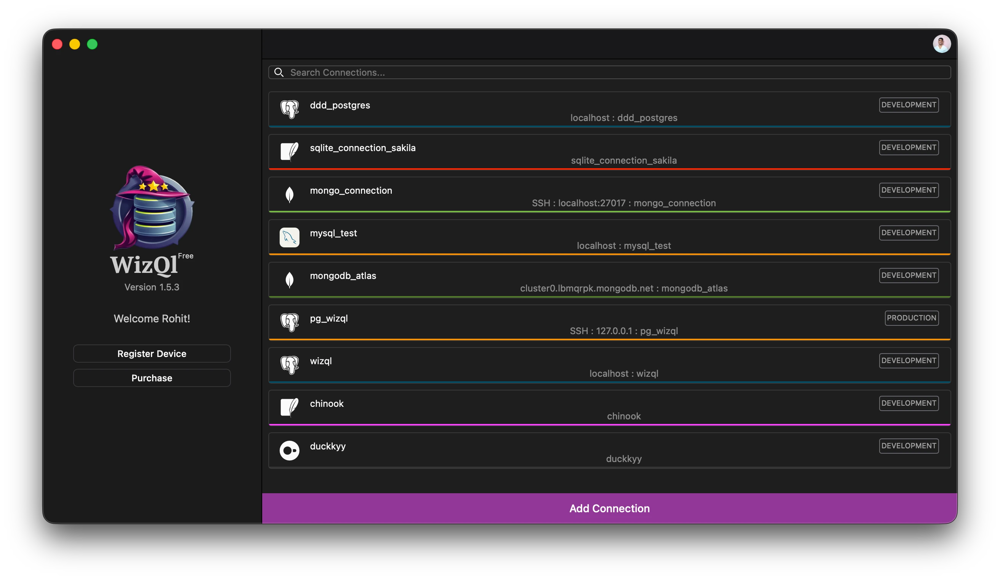
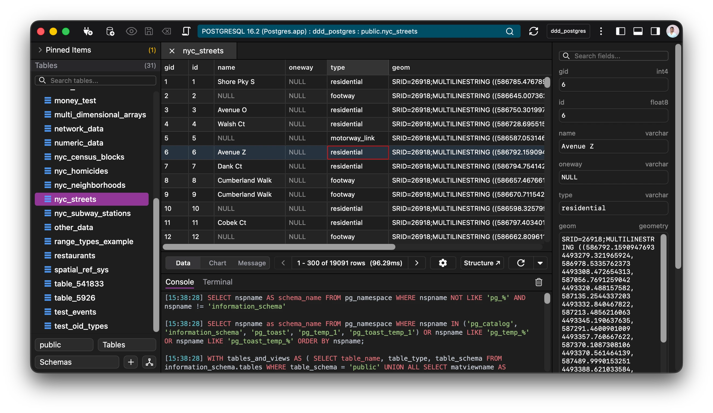
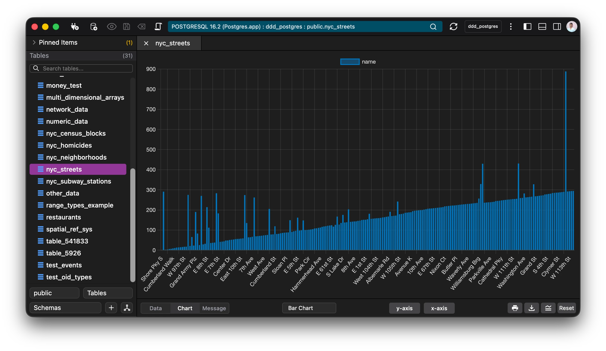
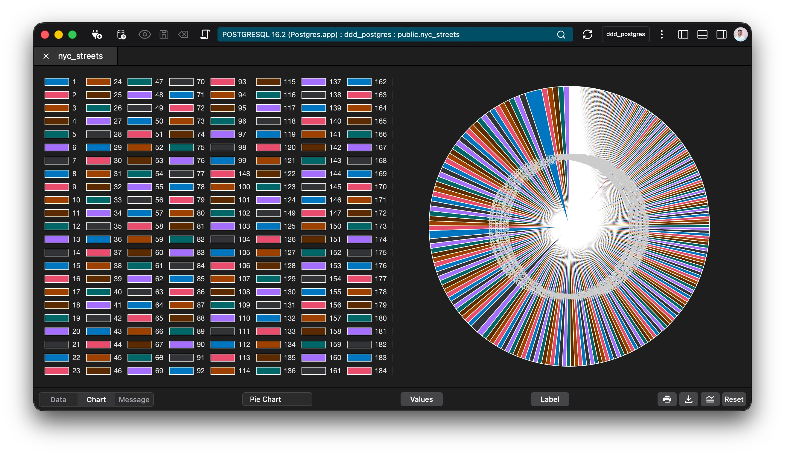
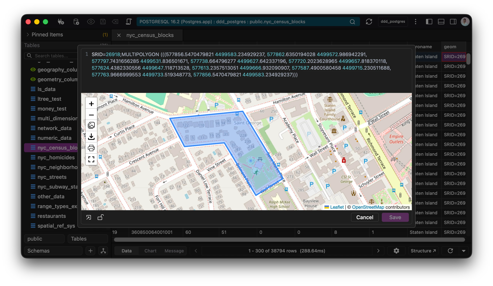
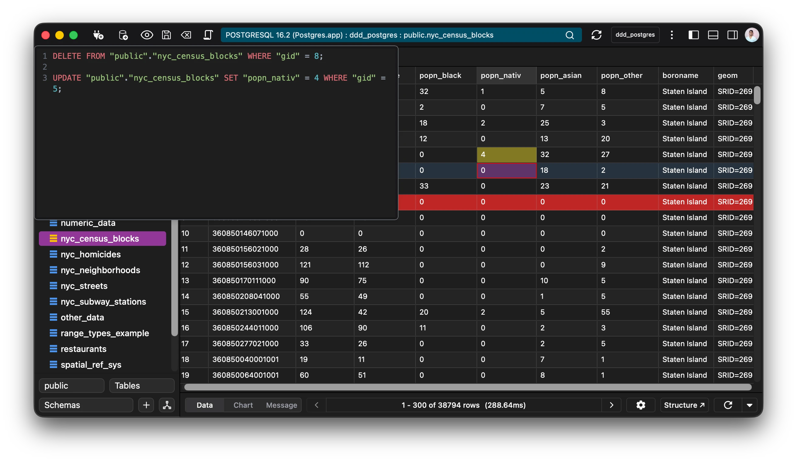

# WizQl

WizQl Issue Tracker

All issues present and past are tracked here.

Please open a new issue after going through the existing issues first.

## Supported Databases

  
 
 
 
 
 
 
 

## Showcase

|                                                  |                                                  |                                                  |
| :----------------------------------------------: | :----------------------------------------------: | :----------------------------------------------: |
|  |  |  |
|  |  |  |

## Features

- [x] Undo redo history across all grids.
- [x] Preview statements before execution.
- [x] Edit tables, functions, views.
- [x] Edit spatial data.
- [x] Query history.
- [x] Inbuilt terminal.
- [x] Connect over SSH securely.
- [x] Use external quickview editor to edit data.
- [x] Quickview pdf, image data.
- [x] Write run queries with full autocompletion support.
- [x] Manage roles and permissions.
- [x] Use sql to query MongoDB.
- [x] API relay to quickly test data in any app.
- [x] Multiple connections and workspaces to multitask with your data.
- [x] 15 languages are supported out of the box.
- [x] Traverse foreign keys.
- [x] Generate QR codes using your data.
